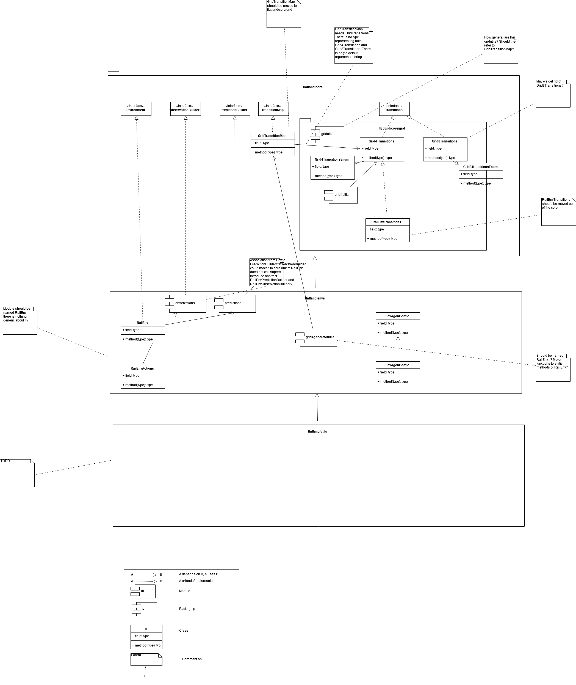

Flatland Specs
==========================

What are **Flatland** specs about?
---------------------------------
In a humand-readable language, they provide
* code base overview (hand-drawn concept)
* key concepts (generators, envs) and how are they linked
* link relevant code base

## Overview

[Diagram Source](https://confluence.sbb.ch/x/pQfsSw)


## Rail Generators and Schedule Generators
The separation between rail generator and schedule generator reflects the organisational separation in the railway domain
- Infrastructure Manager (IM): is responsible for the layout and maintenance of tracks
- Railway Undertaking (RU): operates trains on the infrastructure
Usually, there is a third organisation, which ensures discrimination-free access to the infrastructure for concurrent requests for the infrastructure in a **schedule planning phase**.
However, in the **Flat**land challenge, we focus on the re-scheduling problem during live operations.

Technically, 
``` 
RailGeneratorProduct = Tuple[GridTransitionMap, Optional[Any]]
RailGenerator = Callable[[int, int, int, int], RailGeneratorProduct]

AgentPosition = Tuple[int, int]
ScheduleGeneratorProduct = Tuple[List[AgentPosition], List[AgentPosition], List[AgentPosition], List[float]]
ScheduleGenerator = Callable[[GridTransitionMap, int, Optional[Any]], ScheduleGeneratorProduct]
```

We can then produce `RailGenerator`s by currying:
```
def sparse_rail_generator(num_cities=5, num_intersections=4, num_trainstations=2, min_node_dist=20, node_radius=2,
                          num_neighb=3, grid_mode=False, enhance_intersection=False, seed=0):

    def generator(width, height, num_agents, num_resets=0):
    
        # generate the grid and (optionally) some hints for the schedule_generator
        ...
         
        return grid_map, {'agents_hints': {
            'num_agents': num_agents,
            'agent_start_targets_nodes': agent_start_targets_nodes,
            'train_stations': train_stations
        }}

    return generator
```
And, similarly, `ScheduleGenerator`s:
```
def sparse_schedule_generator(speed_ratio_map: Mapping[float, float] = None) -> ScheduleGenerator:
    def generator(rail: GridTransitionMap, num_agents: int, hints: Any = None):
        # place agents:
        # - initial position
        # - initial direction
        # - (initial) speed
        # - malfunction
        ...
                
        return agents_position, agents_direction, agents_target, speeds, agents_malfunction

    return generator
```
Notice that the `rail_generator` may pass `agents_hints` to the  `schedule_generator` which the latter may interpret.
For instance, the way the `sparse_rail_generator` generates the grid, it already determines the agent's goal and target.
Hence, `rail_generator` and `schedule_generator` have to match if `schedule_generator` presupposes some specific `agents_hints`.

The environment's `reset` takes care of applying the two generators:
```
    def __init__(self,
            ...
             rail_generator: RailGenerator = random_rail_generator(),
             schedule_generator: ScheduleGenerator = random_schedule_generator(),
             ...
             ):
        self.rail_generator: RailGenerator = rail_generator
        self.schedule_generator: ScheduleGenerator = schedule_generator
        
    def reset(self, regen_rail=True, replace_agents=True):
        rail, optionals = self.rail_generator(self.width, self.height, self.get_num_agents(), self.num_resets)

        ...

        if replace_agents:
            agents_hints = None
            if optionals and 'agents_hints' in optionals:
                agents_hints = optionals['agents_hints']
            self.agents_static = EnvAgentStatic.from_lists(
                *self.schedule_generator(self.rail, self.get_num_agents(), hints=agents_hints))
```


## RailEnv Speeds
One of the main contributions to the complexity of railway network operations stems from the fact that all trains travel at different speeds while sharing a very limited railway network. 

The different speed profiles can be generated using the `schedule_generator`, where you can actually chose as many different speeds as you like. 
Keep in mind that the *fastest speed* is 1 and all slower speeds must be between 1 and 0. 
For the submission scoring you can assume that there will be no more than 5 speed profiles.


Currently (as of **Flat**land 2.0), an agent keeps its speed over the whole episode. 

Because the different speeds are implemented as fractions the agents ability to perform actions has been updated. 
We **do not allow actions to change within the cell **. 
This means that each agent can only chose an action to be taken when entering a cell. 
This action is then executed when a step to the next cell is valid. For example

- Agent enters switch and choses to deviate left. Agent fractional speed is 1/4 and thus the agent will take 4 time steps to complete its journey through the cell. On the 4th time step the agent will leave the cell deviating left as chosen at the entry of the cell.
    - All actions chosen by the agent during its travels within a cell are ignored
    - Agents can make observations at any time step. Make sure to discard observations without any information. See this [example](https://gitlab.aicrowd.com/flatland/baselines/blob/master/torch_training/training_navigation.py) for a simple implementation.
- The environment checks if agent is allowed to move to next cell only at the time of the switch to the next cell

In your controller, you can check whether an agent requires an action by checking `info`: 
```
obs, rew, done, info = env.step(actions) 
...
action_dict = dict()
for a in range(env.get_num_agents()):
    if info['action_required'][a]:
        action_dict.update({a: ...})

```
Notice that `info['action_required'][a]` 
* if the agent breaks down (see stochasticity below) on entering the cell (no distance elpased in the cell), an action required as long as the agent is broken down;
when it gets back to work, the action chosen just before will be taken and executed at the end of the cell; you may check whether the agent
gets healthy again in the next step by checking `info['malfunction'][a] == 1`.
* when the agent has spent enough time in the cell, the next cell may not be free and the agent has to wait. 


Since later versions of **Flat**land might have varying speeds during episodes. 
Therefore, we return the agents' speed - in your controller, you can get the agents' speed from the `info` returned by `step`: 
```
obs, rew, done, info = env.step(actions) 
...
for a in range(env.get_num_agents()):
    speed = info['speed'][a]
```
Notice that we do not guarantee that the speed will be computed at each step, but if not costly we will return it at each step.


## RailEnv Malfunctioning / Stochasticity

Stochastic events may happen during the episodes. 
This is very common for railway networks where the initial plan usually needs to be rescheduled during operations as minor events such as delayed departure from trainstations, malfunctions on trains or infrastructure or just the weather lead to delayed trains.

We implemted a poisson process to simulate delays by stopping agents at random times for random durations. The parameters necessary for the stochastic events can be provided when creating the environment.

```
# Use a the malfunction generator to break agents from time to time

stochastic_data = {
    'prop_malfunction': 0.5,  # Percentage of defective agents
    'malfunction_rate': 30,  # Rate of malfunction occurence
    'min_duration': 3,  # Minimal duration of malfunction
    'max_duration': 10  # Max duration of malfunction
}
```

The parameters are as follows:

- `prop_malfunction` is the proportion of agents that can malfunction. `1.0` means that each agent can break.
- `malfunction_rate` is the mean rate of the poisson process in number of environment steps.
- `min_duration` and `max_duration` set the range of malfunction durations. They are sampled uniformly

You can introduce stochasticity by simply creating the env as follows:

```
env = RailEnv(
    ...
    stochastic_data=stochastic_data,  # Malfunction data generator
    ...    
)
```
In your controller, you can check whether an agent is malfunctioning: 
```
obs, rew, done, info = env.step(actions) 
...
action_dict = dict()
for a in range(env.get_num_agents()):
    if info['malfunction'][a] == 0:
        action_dict.update({a: ...})

# Custom observation builder
tree_observation = TreeObsForRailEnv(max_depth=2, predictor=ShortestPathPredictorForRailEnv())

# Different agent types (trains) with different speeds.
speed_ration_map = {1.: 0.25,  # Fast passenger train
                    1. / 2.: 0.25,  # Fast freight train
                    1. / 3.: 0.25,  # Slow commuter train
                    1. / 4.: 0.25}  # Slow freight train

env = RailEnv(width=50,
              height=50,
              rail_generator=sparse_rail_generator(num_cities=20,  # Number of cities in map (where train stations are)
                                                   num_intersections=5,  # Number of intersections (no start / target)
                                                   num_trainstations=15,  # Number of possible start/targets on map
                                                   min_node_dist=3,  # Minimal distance of nodes
                                                   node_radius=2,  # Proximity of stations to city center
                                                   num_neighb=4,  # Number of connections to other cities/intersections
                                                   seed=15,  # Random seed
                                                   grid_mode=True,
                                                   enhance_intersection=True
                                                   ),
              schedule_generator=sparse_schedule_generator(speed_ration_map),
              number_of_agents=10,
              stochastic_data=stochastic_data,  # Malfunction data generator
              obs_builder_object=tree_observation)
```


## Observation Builders
Every `RailEnv` has an `obs_builder`. The `obs_builder` has full access to the `RailEnv`. 
The `obs_builder` is called in the `step()` function to produce the observations.

```
env = RailEnv(
    ...
    obs_builder_object=TreeObsForRailEnv(
        max_depth=2,
       predictor=ShortestPathPredictorForRailEnv(max_depth=10)
    ),
    ...                   
)
```

The two principal observation builders provided are global and tree.

### Global Observation Builder
`GlobalObsForRailEnv` gives a global observation of the entire rail environment.
* transition map array with dimensions (env.height, env.width, 16),
          assuming 16 bits encoding of transitions.

* Two 2D arrays (map_height, map_width, 2) containing respectively the position of the given agent
         target and the positions of the other agents targets.

* A 3D array (map_height, map_width, 4) wtih
            - first channel containing the agents position and direction
            - second channel containing the other agents positions and diretions
            - third channel containing agent malfunctions
            - fourth channel containing agent fractional speeds
            
### Tree Observation Builder
`TreeObsForRailEnv` computes the current observation for each agent.

The observation vector is composed of 4 sequential parts, corresponding to data from the up to 4 possible
movements in a `RailEnv` (up to because only a subset of possible transitions are allowed in RailEnv).
The possible movements are sorted relative to the current orientation of the agent, rather than NESW as for
the transitions. The order is:

    [data from 'left'] + [data from 'forward'] + [data from 'right'] + [data from 'back']

Each branch data is organized as:

    [root node information] +
    [recursive branch data from 'left'] +
    [... from 'forward'] +
    [... from 'right] +
    [... from 'back']

Each node information is composed of 9 features:

1. if own target lies on the explored branch the current distance from the agent in number of cells is stored.

2. if another agents target is detected the distance in number of cells from the agents current location
    is stored

3. if another agent is detected the distance in number of cells from current agent position is stored.

4. possible conflict detected
    tot_dist = Other agent predicts to pass along this cell at the same time as the agent, we store the
     distance in number of cells from current agent position

    0 = No other agent reserve the same cell at similar time

5. if an not usable switch (for agent) is detected we store the distance.

6. This feature stores the distance in number of cells to the next branching  (current node)

7. minimum distance from node to the agent's target given the direction of the agent if this path is chosen

8. agent in the same direction
    n = number of agents present same direction
        (possible future use: number of other agents in the same direction in this branch)
    0 = no agent present same direction

9. agent in the opposite direction
    n = number of agents present other direction than myself (so conflict)
        (possible future use: number of other agents in other direction in this branch, ie. number of conflicts)
    0 = no agent present other direction than myself

10. malfunctioning/blokcing agents
    n = number of time steps the oberved agent remains blocked

11. slowest observed speed of an agent in same direction
    1 if no agent is observed

    min_fractional speed otherwise

Missing/padding nodes are filled in with -inf (truncated).
Missing values in present node are filled in with +inf (truncated).


In case of the root node, the values are [0, 0, 0, 0, distance from agent to target, own malfunction, own speed]
In case the target node is reached, the values are [0, 0, 0, 0, 0].


## Predictors
Predictors make predictions on future agents' moves based on the current state of the environment.
They are decoupled from observation builders in order to be encapsulate the functionality and to make it re-usable.

For instance, `TreeObsForRailEnv` optionally uses the predicted the predicted trajectories while exploring
the branches of an agent's future moves to detect future conflicts.

The general call structure is as follows:
```
RailEnv.step() 
               -> ObservationBuilder.get_many() 
                                                ->  self.predictor.get()
                                                    self.get()
                                                    self.get()
                                                    ...
```
