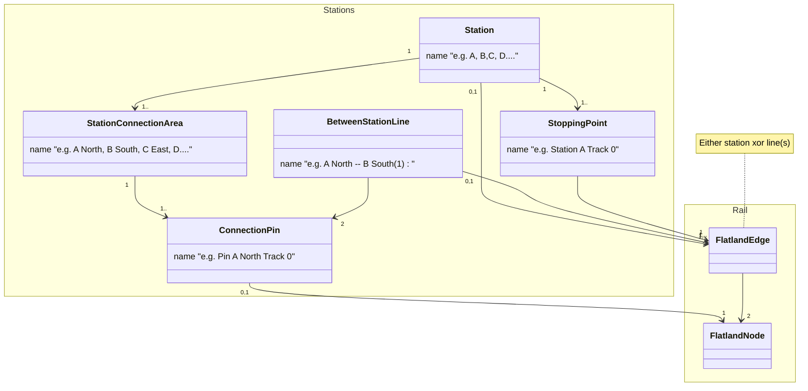

Stations Data Model
===================

## Context and Goal

Currently, `RailEnv` only has a notion of lines at the agent (RU/service level). More precisely,

* `RailEnv` does not expose stations (they come from some rail generators in the agent hints)
* `sparse_rail_generator` internally uses 4 connection areas (North, East, South, West outbound facing) where lines can start and end, but does not pass this
  information to `RailEnv`.

The goal is to extend the interfaces so rail generators (and rail env) CAN expose such information on stations and between station lines (infrastructure/IM
level).

## Logical Model

The logical model is as follows:

* `Station`s cover a certain (disjoint) set of the infrastructure. Currently: list of cells.

* `Station`s have `StationConnectionArea` consisting of `ConnectionPin`s where `BetweenStationLine`s can start and end. Currently: only internally in sparse
  rail generator.
* `BetweenStationLine`s cover wayside infrastructure between two connection pins of two stations. Currently: only internally in sparse rail generator.
* `Station`s have `StoppingPoint`s where trains can start and stop. Currently: list of cells.

