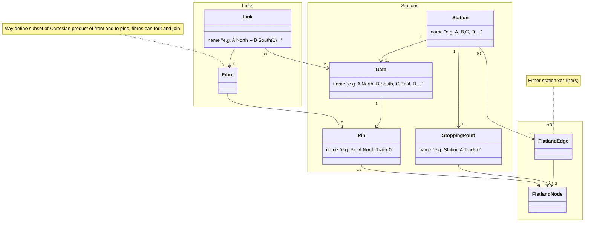

Stations Data Model
===================

## Context and Goal

Currently, `RailEnv` only has a notion of lines at the agent level, i.e. at Railway Undertaking (RU) = "service" level. More precisely,

* `RailEnv` does not expose stations (they come from some rail generators in the agent hints)
* `sparse_rail_generator` internally uses outer connection points grouped by 4 directions (North, East, South, West outbound facing) where lines can start and
  end, but does not pass this
  information to `RailEnv`.

The goal is to extend the interfaces so rail generators (and rail env) CAN expose such information on stations and links between stations at agent-independent
level,
i.e. at Infrastructure Manager (IM) = infrastructure/topology level.

## Logical Model

The logical model is as follows:

* `Station`s cover a certain (disjoint) set of the infrastructure. Currently: list of cells.
* `Station`s have `Gate` consisting of `Pin`s where `Link`s / `Fibre`s can start and end. Currently: only internally in sparse
  rail generator.
* `Fibre`s cover wayside infrastructure between two connection pins of two stations. Currently: only internally in sparse rail generator.
* `Link`s bundle fibres between the same `Gate`s.
* `Station`s have `StoppingPoint`s where trains can start and stop. Currently: list of cells.

## Terminology mapping to `sparse_rail_gen`

| Ours            | sparse rail gen         |
|-----------------|-------------------------|
| `Station`       | city                    |
| `Link`          | inter_city_line         |
| `Gate` / `Pin`  | outer_connection_points |
| `StoppingPint`  | train_station           |
| `Station` cells | free_rail / inner city  |

