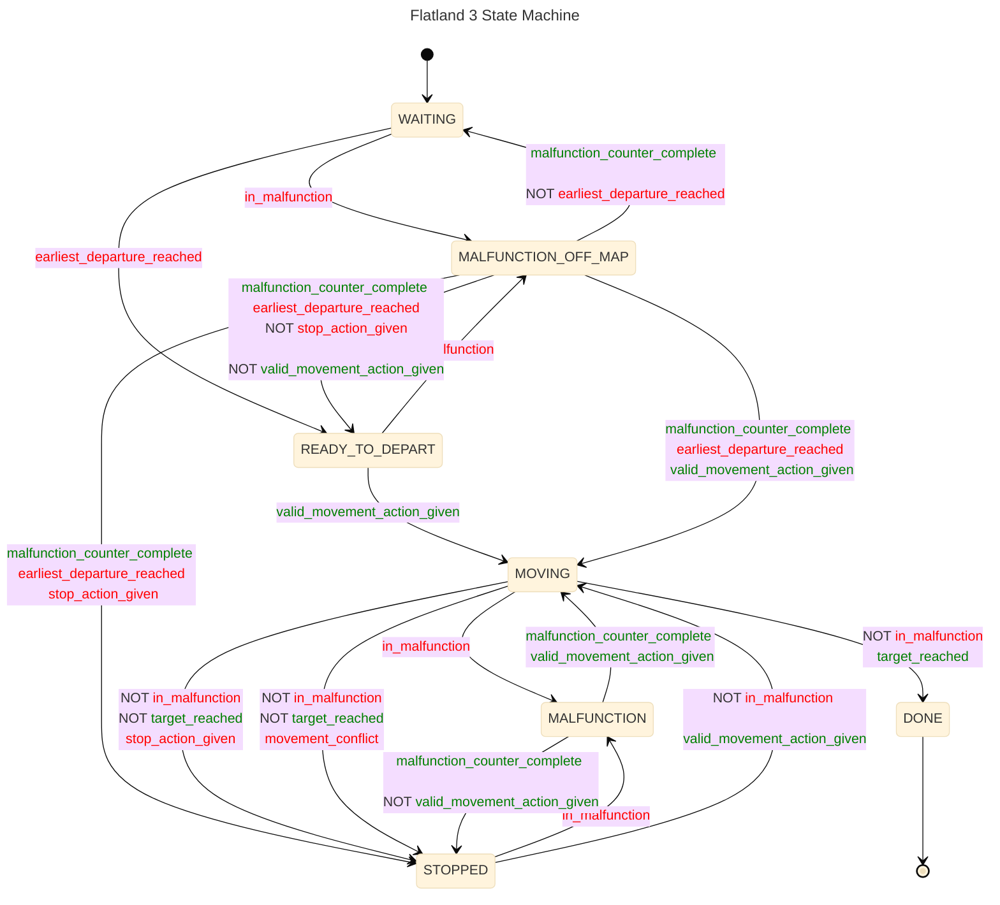
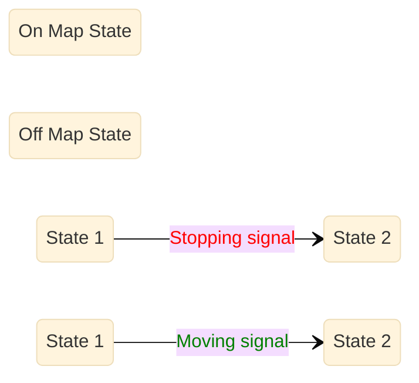
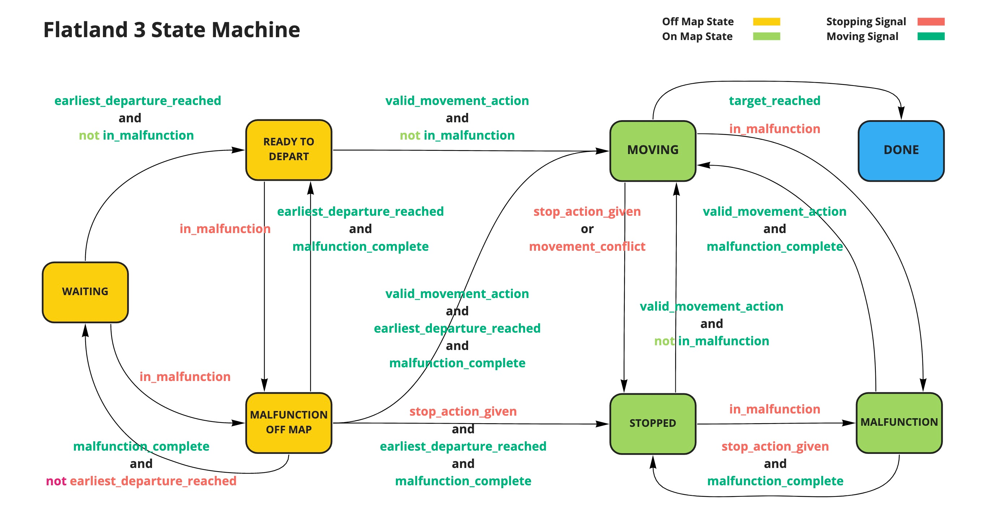

# Flatland 3 State Machine

## New Version (Mermaid)

Same as published with corrections from code.

Legend:

## Published Version

### Differences with code:

* `MALFUNCTION OFF MAP --> READY_TO_DEPART`: malfunction_counter_complete and earliest_departure_reached **and not valid_movement_action_given and not
  stop_action_given**
* `MOVING --> DONE`: **not in_malfunction** and target_reached
* `MOVING --> STOPPED`: **not in_malfunction and not target_reached** and (stop_action_given or movement_conflict)
* `MALFUNCTION --> STOPPED`: malfunction_counter_complete **and not in_malfunction and not valid_movement_action_given**
