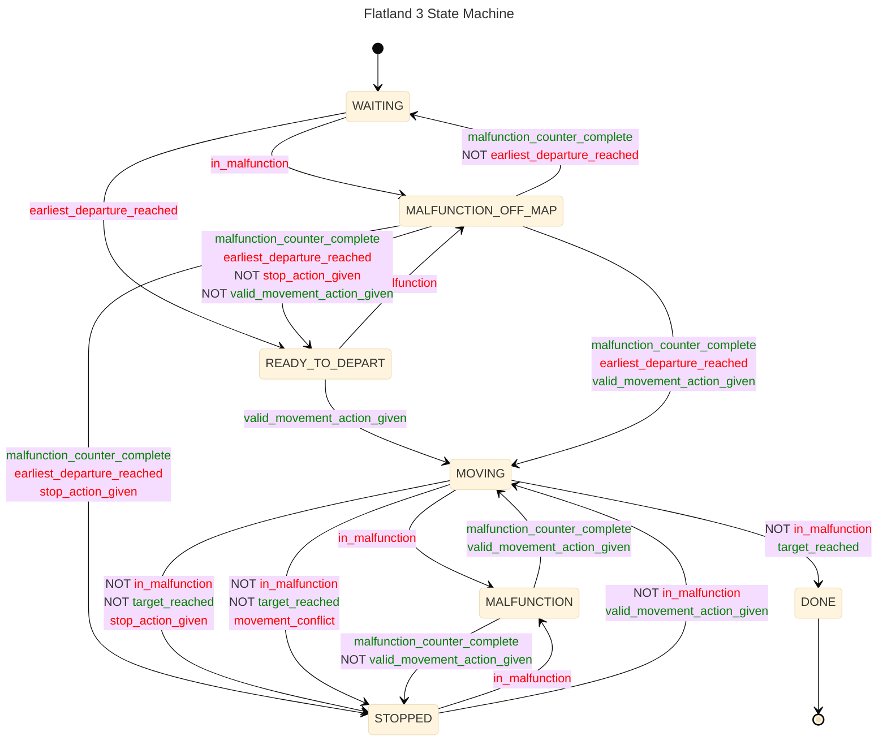
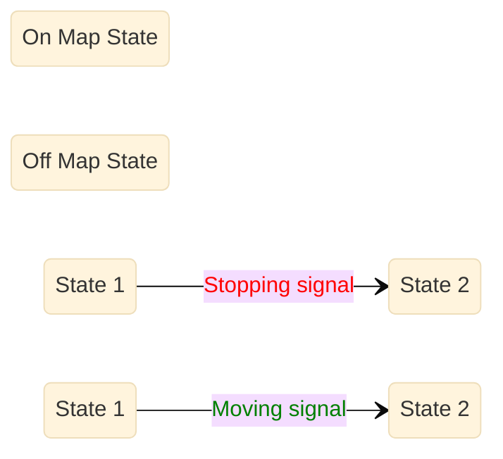

# Flatland 3 State Machine

## New Version (Mermaid)

Same as published with corrections from code.

Legend:

## Published Version

### Differences with code:

* `MALFUNCTION OFF MAP --> READY_TO_DEPART`: malfunction_counter_complete and earliest_departure_reached **and not valid_movement_action_given and not
  stop_action_given**
* `MOVING --> DONE`: **not in_malfunction** and target_reached
* `MOVING --> STOPPED`: **not in_malfunction and not target_reached** and (stop_action_given or movement_conflict)
* `MALFUNCTION --> STOPPED`: malfunction_counter_complete **and not in_malfunction and not valid_movement_action_given**

# State machine

Flatland 3 introduces a state machine as a refactor of `env.step` function in Flatland. The functionality is essentially the same as Flatland 2, this change is
primarily to help users who want to read and modify the code easily.

The goal is to provide a unified state machine which controls the state and transitions of the trains, rather than the older system which had a mix of
`agent.moving` and `agent.status`.

The figure below illustrates the working of the state machine.

The principles we try to implement are as follows:

1. Only a single state transtition is allowed per `env.step`.

2. The action preprocessing ,position changes, speed counters and malfunctions are controlled by the state.

3. All signals for transitioning between states are generated in one place, for easy readability.

## State descriptions

The purpose of each state is described below:

|        State        |            Map Position             | Description                                                                                                                                                                                                                   |
|:-------------------:|:-----------------------------------:|:------------------------------------------------------------------------------------------------------------------------------------------------------------------------------------------------------------------------------|
|       WAITING       |               Off Map               | No actions allowed here, when current timestep is behind earliest departure.                                                                                                                                                  |
|   READY_TO_DEPART   |               Off Map               | Train is ready to move and will start at `initial_position` when moving action is provided.                                                                                                                                   |
| MALFUNCTION_OFF_MAP |               Off Map               | When a randomized malfunction occurs in an `off map` state, any moving actions provided here are stored and used when malfunction completes, unless stop action is provided.                                                  |
|       MOVING        |               On Map                | Indicates the train is moving, if speed is 1.0, the train changes position every timestep.                                                                                                                                    |
|       STOPPED       |               On Map                | Indicates the train is stopped, this can occur when the user provides a stop action, or the train tries to move into a cell that is occupied or to a cell which does not have a track.                                        |
|     MALFUNCTION     |               On Map                | When a randomized malfunction occurs in an `on map` state, any moving actions provided here are stored and used when malfunction completes, unless stop action is provided. No movement can occur during a malfunction state. |
|        DONE         | Depends on `remove_agent_at_target` | This is a terminal state which is activated when the target is reached.                                                                                                                                                       |

## State transition signals

The corresponding signals in the state machine are described below

| State Transition Signal      | Description                                                                                                                                                                            |
|------------------------------|----------------------------------------------------------------------------------------------------------------------------------------------------------------------------------------|
| in_malfunction               | Malfunction states start when in_malfunction is set to true                                                                                                                            |
| malfunction_counter_complete | Malfunction counter complete - Malfunction state ends this timestep and actions are allowed from next timestep                                                                         |
| earliest_departure_reached   | Earliest departure reached - Train is allowed to move now                                                                                                                              |
| stop_action_given            | Stop Action Given - User provided a stop action. Action preprocessing can also change a moving action to a stop action if the train tries to move into a invalid or occupied position. |
| valid_movement_action_given  | Movement action is provided and movement is allowed, note that a train can move into an occupied cell if that cell is being emptied by the train that was previously occupied it.      |
| target_reached               | Target position is reached                                                                                                                                                             |
| movement_conflict            | Movement conflict - Multiple trains trying to move into same cell                                                                                                                      |

