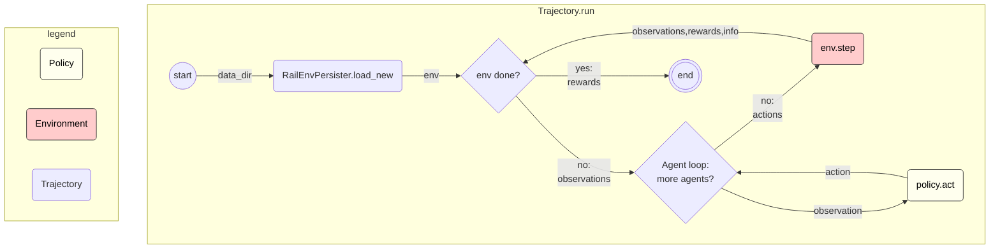
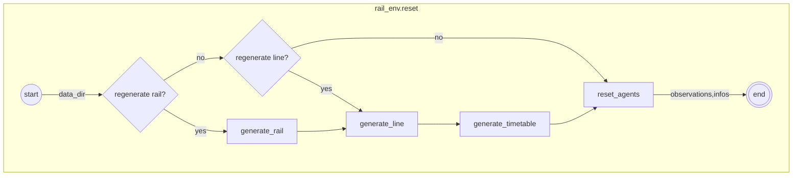
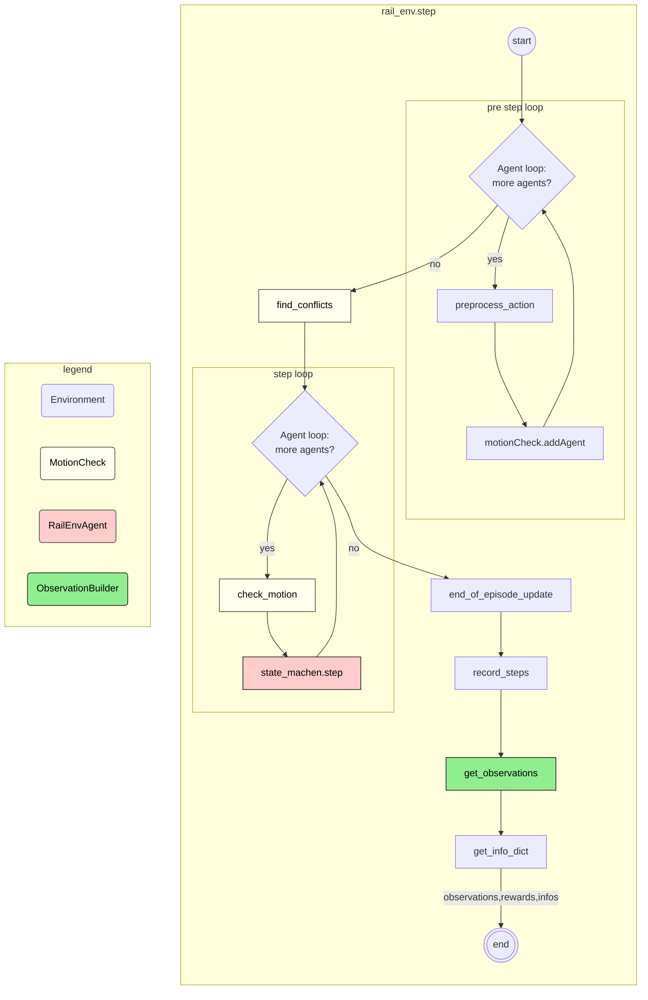

Trajectories
============

TODO move to `flatland-book`?

Data Model
----------

Remarks:

* Trajectory needs not start at step 0
* Trajectory needs not contain state for every step - however, when starting the trajectory from an intermediate step, the snapshot must exist.

Flow Trajectory Run
-------------------

Flow Env Reset
--------------

Flow Env Step
--------------

